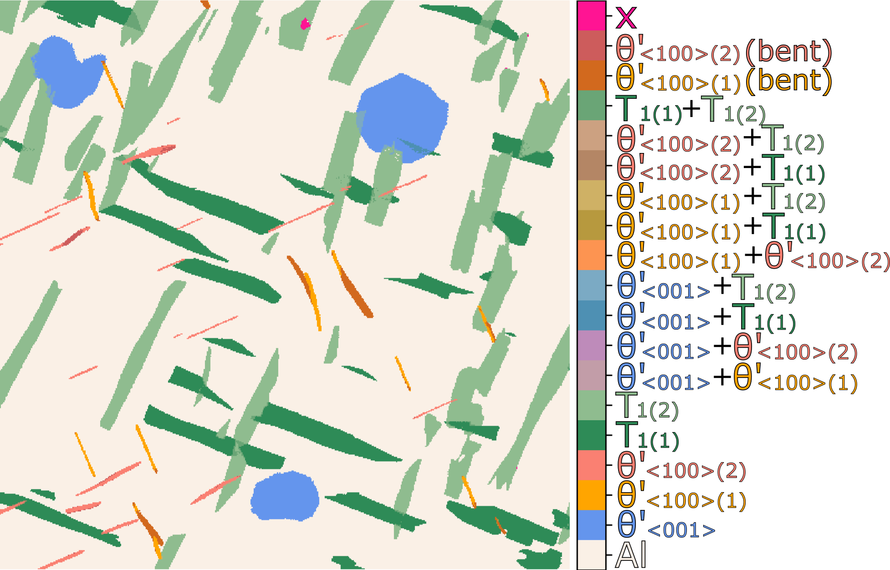

## The model system

Figure 4 presents the six phase maps resulting from using the three ways of defining templates (A: simulations; B: manual; C: NMF) and two ways of phase labelling (maximum NCC; prioritisation scheme), together with the ground truth. 
\hl{Antar ground truth inkluderes i den interaktive?}
The phase maps are diplayed besides their corresponding difference maps that shows correspondence to ground truth in black and any discrepancies in white. 
The main difference between the two phase labelling strategies is whether or not the $\uptheta'$\textsubscript{$\langle001\rangle$} plates that give only a few weak Bragg disks are prioritised over overlapping T\textsubscript{1} segments. 
Mislabeling at or near phase interfaces is a common feature in all the phase maps, due to weak precipitate Bragg disks, and/or strain causing a difference in Bragg disk positions. 
The same was reported in the previous study [@Thronsen2024], where it was also pointed out that such artefacts are relatively harmless unless precipitate size statistics is to be extracted from the phase maps. 
The accuracies of the phase maps relative to the ground truth are summarised in Table 3. 
All yield accuracies of $\approx$99\%, demonstrating a strong agreement between the derived phase maps, the ground truth phase map, and the previously presented results [@Thronsen2024]. 

\setkeys{Gin}{width=.7\linewidth}

To look more in detail into some of the mislabelled regions, the phase map produced from kinematical simulations are used, since this one has the most discrepancies. 
The phase map and difference map are shown in Figure 5(a) and (b), respectively, where two regions with mislabelled $\uptheta'$\textsubscript{$\langle$100$\rangle$} precipitates and a third region containing a mislabelled T\textsubscript{1} segment, are highlighted.
These areas are magnified and overlayed with the difference map in Figures 5(c)-(e). 
One correctly labelled and one incorrectly labelled single pre-processed PED pattern are presented under each region in (c)-(e). 
These patterns are overlayed with dashed circles that represent the Bragg spots of the simulated templates that would be correct according to the ground truth phase map. 
For (c) and (d), the mislabelled regions correspond to bent $\uptheta'$\textsubscript{$\langle100\rangle$} precipitates, and the corresponding patterns show weaker and less Bragg spots compared to the correctly labelled patterns. 
The mislabelled segment inside the T\textsubscript{1} precipiate, shown in Figure 5(e), is a common feature in all of the phase maps. 
The selected PED patterns in (e) are overlayed with the simulated Bragg spots corresponding to the template of T\textsubscript{1-2}, which is expected based on the ground truth. 
The pattern in the mislabelled region does not, however, correspond to this simulated pattern, and the pattern represents a new unique diffraction pattern that was not included in the original template bank. 

\setkeys{Gin}{width=.7\linewidth}
.png "PM of the model dataset with simulated templates. (a) Phase map, and (b) difference map with respect to the ground truth phase map. Three regions are highlighed where precipitate segments are incorrectly labelled according to the ground truth. (c)-(e) Zoomed-in maps from the highlighted regions with single PED patterns from indicated regions included underneath. The patterns are pre-processed until step 1.2 (left) and 1.4 (right). The patterns in (c) and (d) are overlayed with dashed circles that represent the disk positions in the two $\uptheta$'\textsubscript{$\langle100\rangle$} templates that are correct based on the ground truth. The diffraction patterns in (e) are overlayed with dashed circles showing the disk positions in templates from the expected T\textsubscript{1} phase. All PED patterns are plotted in log-scale, and overlayed with stars representing the centre spot (red) and the Al reflections (white).")

One of the main advantages of the PM workflow is that additional templates can easily be included after the first phase mapping step. 
To demonstrate this possibility, additional template patterns were searched for in regions with low NCC scores and added to the template bank. 
Furthermore, template patterns representing pairs of overlapping crystals were also defined and included in the template bank to further highlight the flexibility of the PM approach. 
Figure 6 presents the phase map obtained after including overlap templates together with additional templates found by NMF-guided selection (approach C). 
The map presents the same phases as in the previous phase maps, but includes new labels like overlapping phases and the bent $\uptheta'$\textsubscript{$\langle100\rangle$} segments discussed previously. 
The missing unfamiliar T\textsubscript{1} segment highlighted in Figure 5(e) is now included and labelled as 'x'. 
This updated phase map thus demonstrates that both pre-known and unfamiliar patterns can be identified and mapped after an additional iteration of searching for new templates. 
This map also shows that overlapping crystals can be correctly labelled along with non-overlapping crystals, which suggests that the previously used phase prioritisation scheme [@Thronsen2024] becomes unnecessary. 

\setkeys{Gin}{width=.7\linewidth}

